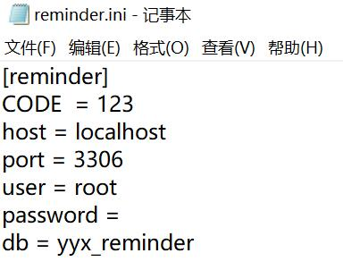

### 项目简介

将需要记忆的内容提交至服务器

通过遗忘曲线, 提供每天需要复习的内容

### 食用方法



填写reminder.ini的信息,

1. CODE 代表密码
2. host 表示 MySQL 的地址
3. port 表示 MySQL 的端口
4. user表示 MySQL 的用户名
5. password 表示 MySQL 的密码
6. db 表示 MySQL 中的数据库 

在 MySQL 中建立db对应的数据库, 建立数据表

```
create table content(
    create_date timestamp DEFAULT CURRENT_TIMESTAMP,
    content longblob NOT NULL
)charset=utf8;
```

运行main.py

默认开放端口为7000

可以再main.py 最下方进行修改

### 演示

咕咕咕

### 开发日志

* 2020-7-13 开始
* 2020-7-14 第一版出现了